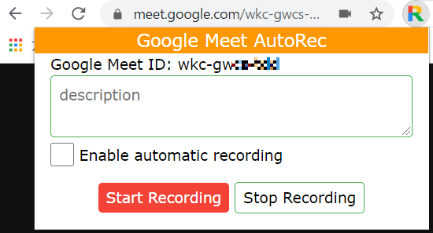

# Google Meet AutoRec Extension

This is a Google Chrome extension to add automatic video recording for Google Meet meetings.
It keeps meeting URLs which you need to record every time.
Onece you enable automatic recording, the meeting is automatically recorded when you open the same meeting.

Developed and tested primarily on Chrome 89.

## Installing

1. From the [Releases page](https://github.com/ychubachi/google_meet-autorec/releases), download the source code zip and extract it somewhere you can keep it.
2. From Chrome's Extension settings (`chrome://extensions/`), turn on "Developer mode" using the toggle in the top-right corner.
4. Click the "Load unpacked" button in the top-left corner, and select the `browser-extension` folder from the zip you extracted earlier.
5. You can turn Developer mode back off now if you want.
6. To pin this extension to the Chrome toolbar, click the `Extension` button near the profile avatar in the top-right corner of your browser.  Click a pin icon next to `Google Meet AutoRec`.

## Usage

1. Open your Google Meet meeting which you want to enable automatic recording.
2. Click the icon to open the popup dialog (It will be disabled if the page is not Google Meet).
3. In the dialog, you can write a `description` of the meeting which is stored in the browser storage.
3. Check `Enable automatic recording` checkbox.  This extension keeps the status.
4. You can start recording and stop recoring with `Start recoridng` or `Stop recording` button if you want (optional).
5. Next time you open the metting with same url, video recoridng is automatically started.

# Limitation
- This extension works only when you have a recording permissios of the meeting.